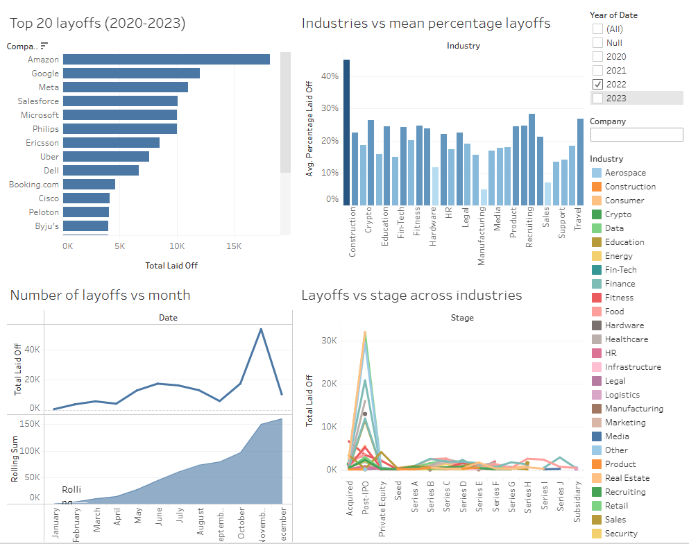

## World Layoffs Data Analysis (2020-2023)

### Project Overview
This project involved cleaning and analyzing a dataset of global layoffs from 2020 to 2023 using MySQL and visualizing the results with Tableau. The main objective was to identify trends and patterns in layoffs across different industries and months, providing insights into the employment landscape during this period.

### Data Cleaning and Preparation
The data was cleaned and prepared using a series of SQL scripts in MySQL Workbench, ensuring the reliability of the analysis. The steps included:
- Removing duplicates and standardizing text entries for uniformity.
- Handling null values strategically to maintain data integrity.
- Populating missing values based on data from relevant rows.

### Exploratory Data Analysis (EDA)
After preparing the data, I performed some EDA to uncover underlying patterns and trends. Key analyses included:
- Computing total and average layoffs by industry, country, and company.
- Analyzing layoff events over time to capture trends across months and years.
- Assessing the impact of layoffs by company stage and size.

### Visualization
The final step involved creating a Tableau dashboard that visually represents the analysis, making the data accessible and understandable. The dashboard features:
1. Top 20 layoffs from 2020 to 2023.
2. Industries vs. mean percentage of layoffs.
3. Monthly layoff trends.
4. Layoff distribution by stage across industries.

[link to dashboard](https://public.tableau.com/views/world_layoffs/Dashboard1?:language=en-US&:sid=&:display_count=n&:origin=viz_share_link)

### Skills Highlighted
- **SQL**
- **Data Cleaning and Validation**
- **Data Analysis**
- **Visualization**

